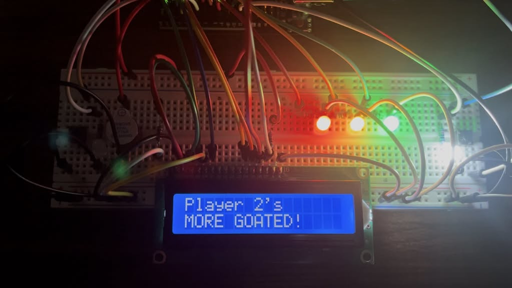
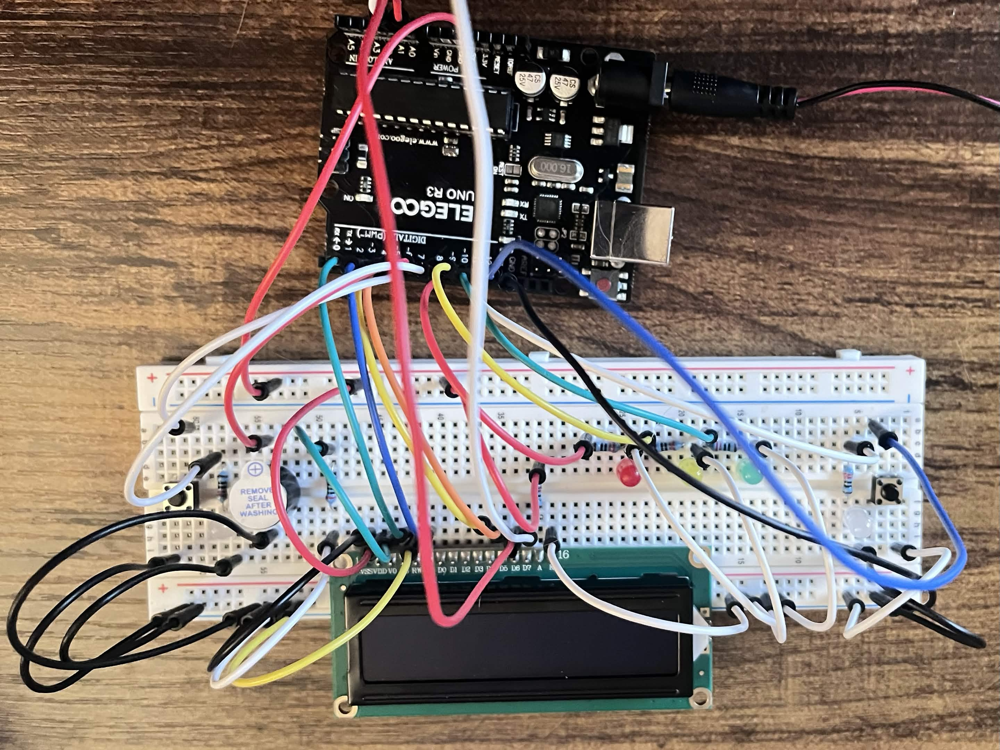

##Two-Player Reaction Time Project (Arduino)

  

A two-player reaction time competition game implemented on an Arduino Uno.  
The system interfaces with hardware such as buttons, LEDs, buzzer, and a 16×2 LCD to create a fully interactive embedded device with scoring, timing logic, and user feedback.

This project was designed to demonstrate real embedded systems behavior: the program continuously monitors external inputs and deterministically controls physical outputs in real time.

---

## Overview

The device functions similarly to a reaction testing machine or industrial operator panel.  
Players wait for the green signal and race to press their button first. The system tracks scores, announces winners, and resets for replay without restarting the microcontroller.

Core behaviors:
- randomized start timing
- real-time input monitoring
- persistent scoring
- win detection
- audiovisual feedback

---
## Features

- Two-player reaction competition
- Random delay to prevent anticipation
- Score tracking to 5 points
- LCD scoreboard interface
- Startup animation and sound
- Victory melody with synchronized LED flashing
- Replay prompt without reset
- Button debounce handling

---
## Hardware

  

|         Component        |             Purpose            |
|--------------------------|--------------------------------|
| Arduino Uno              | Microcontroller / control unit |
| 16×2 LCD (LiquidCrystal) | User interface & score display |
| Push Buttons (2)         | Player input                   |
| LEDs                     | System state indicators        |
| Piezo Buzzer             | Audio feedback                 |
| Resistors                | Current limiting               |
| Breadboard + Jumpers     | Prototyping                    |

  

---
## System Operation

1. System initializes and displays welcome message
2. Red and yellow LEDs signal an upcoming start
3. A randomized delay occurs
4. Green LED turns on (players may now press)
5. First button press wins the round
6. Score updates on LCD
7. First player to 5 points wins the match
8. System prompts replay

---

## Wiring

  

Important details:
- Buttons use `INPUT_PULLUP` configuration
- LCD runs in 4-bit parallel mode
- Buzzer driven using PWM tone generation
- LEDs controlled via digital output pins

---

## Software Structure

The program behaves as a **finite state machine** implemented inside the Arduino `loop()`.

### Major Functions

|         Function       |             Role            |
|------------------------|-----------------------------|
| `setup()`              | Hardware initialization     |
| `startupSequence()`    | Boot animation & sound      |
| `startGame()`          | Randomized reaction trigger |
| `loop()`               | Main event monitoring       |
| `updateScoreDisplay()` | LCD interface updates       |
| `showWinner()`         | End game logic              |
| `victorySound()`       | Audio/visual feedback       |
| `endGame()`            | Reset outputs               |

---

## Embedded Concepts Demonstrated

### Button Debouncing
Mechanical switches produce multiple rapid signals when pressed.  
Handled using a debounce delay to prevent false triggers.

### Real-Time Input Monitoring
The microcontroller continuously checks hardware input pins and reacts immediately to user actions.

### Deterministic Output Control
Only one winner is detected even if buttons are pressed nearly simultaneously.

### Human-Machine Interface (HMI)
The LCD communicates system status:
- scores
- winner
- replay prompt

### Hardware Interaction
The program directly controls:
- LED current
- buzzer frequency
- LCD data bus

---
## What This Demonstrates

This project demonstrates skills relevant to embedded and electrical engineering:

### Hardware
- wiring circuits from a schematic
- using pull-up inputs
- current limiting
- debugging electrical issues

### Firmware
- digital I/O
- timing control
- state-based logic
- handling asynchronous input
- user interface logic

---
### System Design
The project follows a complete embedded control loop:

INPUT -> PROCESS -> OUTPUT -> USER FEEDBACK -> RESET

---
## How to Run

1. Clone the repository
2. Open the `.ino` file in Arduino IDE
3. Install `LiquidCrystal` (included with Arduino IDE)
4. Upload to Arduino Uno

---
##

(holy yap)
